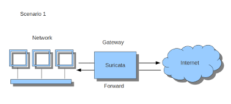
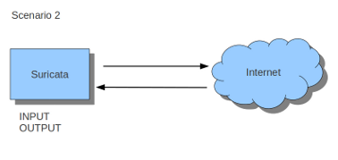

Setting up IPS/inline for Linux
================================

このガイドでは、レイヤ3インラインモードでSuricataを使用する方法と、その目的のためにiptablesを設定する方法について説明します。

NFQをサポートしたSuricataのコンパイルから始めます。 指示
`Ubuntuのインストール
<https://redmine.openinfosecfoundation.org/projects/suricata/wiki/Ubuntu_Installation>`_.
For more information about NFQ and iptables, see
:ref:`suricata-yaml-nfq`.

SuricataでNFQが有効になっているかどうかを確認するには、次のコマンドを入力します。

::

  suricata --build-info

  フィーチャ間にNFQがあるかどうかを調べます。

  NFQモードでsuricataを実行するには、-qオプションを使用する必要があります。 このオプションは、Suricataにどのキュー番号を使用するかを指示します。

::

  sudo suricata -c /etc/suricata/suricata.yaml -q 0

Iptables configuration
~~~~~~~~~~~~~~~~~~~~~~

まず、Suricataに送信したいトラフィックを知ることが重要です。 コンピュータから送信されたトラフィックまたはコンピュータによって生成されたトラフィック。

Suricataがゲートウェイ上で動作していて、そのゲートウェイの背後にあるコンピュータを保護するためのものであれば、最初のシナリオである* forward_ing *を処理しています。
Suricataが実行中のコンピュータを保護しなければならない場合、2番目のシナリオ：*ホスト*（図2参照）を扱っています。
Suricataを使用するこれら2つの方法を組み合わせることもできます。

Suricataにトラフィックを送信するゲートウェイシナリオの場合の最も簡単なルールは次のとおりです。:

::

  sudo iptables -I FORWARD -j NFQUEUE

この場合、転送されたすべてのトラフィックはSuricataに送られます。

このホスト状況の場合、これらは最も簡単な2つのiptableルールです。

::

  sudo iptables -I INPUT -j NFQUEUE
  sudo iptables -I OUTPUT -j NFQUEUE

キュー番号を設定することができます。 そうしないと、キュー番号はデフォルトで0になります。

たとえば、TCPトラフィックだけ、またはポート80のすべての着信トラフィック、または宛先ポート80のすべてのトラフィックをSuricataで確認する場合は、次のようにします。

::

  sudo iptables -I INPUT -p tcp  -j NFQUEUE
  sudo iptables -I OUTPUT -p tcp -j NFQUEUE

この場合、SuricataはTCPトラフィックだけをチェックします。

::

  sudo iptables -I INPUT -p tcp --sport 80  -j NFQUEUE
  sudo iptables -I OUTPUT -p tcp --dport 80 -j NFQUEUE

この例では、Suricataはポート80のすべての入力と出力をチェックします。

.. image:: setting-up-ipsinline-for-linux/iptables2.png

.. image:: setting-up-ipsinline-for-linux/IPtables3.png

iptablesのルールを正しく設定しているかどうかを確認するには、Suricataが実行されていることを確認してください:

::

  sudo iptables -vnL

この例では、パケットが記録されているかどうかを確認できます。

.. image:: setting-up-ipsinline-for-linux/iptables_vnL.png

iptablesのこの使用方法は、IPv4で使用する方法です。 IPv6でそれを使用するには、前述のコマンドはすべて 'ip6tables'で始める必要があります。 Suricataに両方の種類のトラフィックをチェックさせることも可能です。

There is also a way to use iptables with multiple networks (and interface cards). Example:

::

  sudo iptables -I FORWARD -i eth0 -o eth1 -j NFQUEUE
  sudo iptables -I FORWARD -i eth1 -o eth0 -j NFQUEUE

The options -i (input) -o (output) can be combined with all previous mentioned options

If you would stop Suricata and use internet, the traffic will not come through. To make internet work correctly, you have to erase all iptable rules.

To erase all iptable rules, enter:

::

  sudo iptables -F
